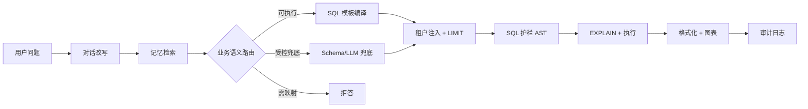

# Architecture

`text2sql-mvp` validates a **guarded Text-to-SQL pipeline** suitable for production analytics assistants. The LLM never gets a generic SQL executor; every path is constrained by whitelist schema and business semantics.

## Request flow

```text
用户问题 → 对话改写 → 记忆检索 → 业务语义路由
                                    ├─ 可执行   → SQL模板编译 ─────┐
                                    ├─ 受控兜底  → Schema/LLM兜底 ─┤
                                    └─ 需映射   → 拒答    
                                                                ↓
                                          租户注入 + LIMIT → SQL 护栏 AST → EXPLAIN + 执行
                                                                ↓
                                                   格式化 + 图表 → 审计日志
```

路由分支与配置 `status` 对应关系：

| 分支 | 配置 status | 说明 |
|------|-------------|------|
| 可执行 | `executable` | 命中意图且有模板，走 SQL 模板编译 |
| 受控兜底 | `guarded_text2sql` | 无模板，在 Schema 白名单内由 Schema/LLM 生成 |
| 需映射 | `needs_mapping` | 口径未配置，拒答并返回原因 |



## 请求链路十步骨架

快速模式不是「让模型写 SQL」，而是 **召回 → 精排 → 模板 → 护栏**。

| 步骤 | 做什么 | 是否调大模型 |
|------|--------|--------------|
| 1. 对话改写 | 「折线图也生成一下」→ 补全成完整问句（规则引擎） | 否 |
| 2. 记忆检索 | 加载用户/租户确认过的口径、映射、纠正规则 | 否 |
| 3. 意图识别 | 向量召回 → 关键词打分 → 可选大模型精排 + 抽槽 | 最多 1 次 |
| 4. 路由决策 | 可执行走模板 / 受控兜底走 Schema·大模型 / 需映射则拒答 | 视路径 |
| 5. SQL 生成 | 模板渲染，或 Schema 白名单内受控生成 | 兜底路径可能 1 次 |
| 6. 租户注入 | 后端强制加租户 ID，不让模型决定查哪个组织 | 否 |
| 7. SQL 护栏 | 白名单表字段、只读、行数 LIMIT | 否 |
| 8. EXPLAIN 预检 | 估算扫描行数，过重则拒执行 | 否 |
| 9. 执行 + 格式化 | 查库 → 文字摘要 + 表格 + ECharts 图表 | 否 |
| 10. 审计 | 记录问了什么、命中哪个意图、用了哪条 SQL | 否 |

**术语对照（讲课时可一带而过）：**

| 中文 | 代码/英文 | 含义 |
|------|-----------|------|
| 召回 | Retrieve | 从大量意图里先捞出候选 |
| 精排 | Rank | 在候选里选出最终意图 |
| 模板 | Template | 预先审核的 SQL 骨架 |
| 护栏 | Harness | 规则、校验、权限边界，约束输出 |
| 可执行 | `executable` | 有模板，走主路径 |
| 受控兜底 | `guarded_text2sql` | 无模板，在白名单内生成 |
| 需映射 | `needs_mapping` | 口径未配，拒答 |

## 什么算「规则引擎」

**规则引擎** = 把业务逻辑从流程代码里拆出来，变成**可独立注册、按策略执行、首命中或全命中**的规则集合，由**统一调度器**运行。

至少要具备这四件事：

| 要素 | 含义 | 本项目的实现 |
|------|------|--------------|
| **规则抽象** | 每条规则是独立单元（id + 条件 + 动作） | `FollowUpRule(id, priority, rewrite)` |
| **规则注册** | 规则集中管理，不散落在 if/elif 里 | `_build_rules()` → `_RULES` |
| **调度策略** | 明确「谁先跑、跑几个、冲突怎么办」 | 按 `priority` 降序，**第一个成功即停** |
| **输入/输出分离** | 引擎只负责「选规则、执行」，不关心下游 SQL | 输入 `(question, history)`，输出 `effective_question` + `reason` |

代码位置：

- 入口：`conversation.py` → `contextualize_question()`
- 调度器：`conversation_rewrite.py` → `apply_follow_up_rewrites()`
- 共享工具：`conversation_context.py`（history、是否追问、找上轮问句）

### 规则引擎的「成熟度」光谱

```text
if/elif 链
    ↓ 抽出规则列表 + 循环
轻量规则引擎（本项目）     ← 函数注册，代码里配 priority
    ↓ 规则声明式配置
配置驱动规则引擎             ← yaml/json 定义 trigger + transform
    ↓ + 推理/冲突/回溯
完整规则引擎（Drools、RETE）  ← 复杂业务决策，大量规则互相触发
```

对话改写场景规则少（约 10 条）、变化不频繁，**轻量规则引擎足够**；不必为改一条追问规则引入 Drools。

### 对话改写中的规则示例

| priority | 规则 id | 类型 |
|---------|---------|------|
| 100 | `chart_type_follow_up` | 通用：饼图 → 折线图 |
| 91 | `count_to_list_follow_up` | 通用：「有多少人」→「是谁」→「有哪些」 |
| 10 | `dimension_slot_follow_up` | 通用：「那按状态呢」→ 替换上轮分组维度 |
| 95–89 | person_count / grid / ledger … | 领域专用 |

改写成功后，`interactionLogs` 中可见 `kind=conversation`、`rewriteReason=…`、`originalQuestion` / `effectiveQuestion`。

## Layers

### 1. Whitelist schema (`configs/whitelist_tables.yaml`)

Defines allowed tables, columns, estimated row counts, indexes, and join paths. The SQL guard rejects references outside this catalog.

Each scoped table declares a `domain_column` (demo: `tenant_id`). The runtime injects `table.domain_column = %(domain_id)s` when missing.

### 2. Business semantics (`configs/business_semantics.yaml`)

Each **intent** includes:

- lexical `match` rules and optional vector `semantic.queries`
- `status`: `executable`, `needs_mapping`, etc.
- `template` id pointing to `sql_templates`

Only `executable` intents with templates produce SQL on the semantic path. This prevents hallucinated metrics.

### 3. Conversation layer

Short follow-ups inherit subject and grouping dimensions from history. Chart-type follow-ups (e.g. pie → line) rewrite the prior full question instead of producing ambiguous queries.

实现见上文 **「什么算规则引擎」**；核心模块 `conversation_rewrite.py`。

### 4. SQL policy & guard

- SELECT-only
- Parameterized sensitive values (phone numbers never embedded in SQL text)
- Automatic LIMIT for non-scalar results
- Optional EXPLAIN-based cost rejection in live mode

### 5. Execution modes

| Mode | Behavior |
|------|----------|
| `dry_run` (default) | Compile and validate SQL, return plan |
| `live` | Execute against MySQL when credentials are configured |

### 6. Surfaces

- **HTTP** (`text2sql_api`) — `/v1/query`, `/v1/query/estimate`, audit APIs, `/chat`
- **MCP** (`text2sql_mcp`) — same `Text2SqlService` as tools/resources

## Customizing for your product

1. Replace `whitelist_tables.yaml` with your schema (use `scripts/introspect_schema.py`).
2. Add intents and SQL templates in `business_semantics.yaml`.
3. Extend `eval_cases/cases.yaml` for regression coverage.
4. Optionally enable LLM fallback via `.env.local` — semantic templates remain the primary path.

## Demo domain

The stock config models a payment analytics slice:

- `payment_order` — channel, amount, status, payer_mobile (sensitive)
- `refund_order` — daily refund counts
- `merchant` — ranked by payment volume

This is intentionally small so the repo stays easy to fork.
