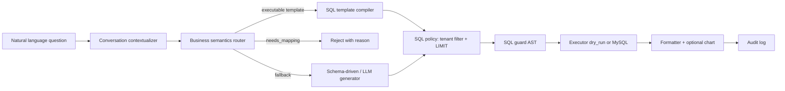

# Architecture

`text2sql-mvp` validates a **guarded Text-to-SQL pipeline** suitable for production analytics assistants. The LLM never gets a generic SQL executor; every path is constrained by whitelist schema and business semantics.

## Request flow

## Layers

### 1. Whitelist schema (`configs/whitelist_tables.yaml`)

Defines allowed tables, columns, estimated row counts, indexes, and join paths. The SQL guard rejects references outside this catalog.

Each scoped table declares a `domain_column` (demo: `tenant_id`). The runtime injects `table.domain_column = %(domain_id)s` when missing.

### 2. Business semantics (`configs/business_semantics.yaml`)

Each **intent** includes:

- lexical `match` rules and optional vector `semantic.queries`
- `status`: `executable`, `needs_mapping`, etc.
- `template` id pointing to `sql_templates`

Only `executable` intents with templates produce SQL on the semantic path. This prevents hallucinated metrics.

### 3. Conversation layer

Short follow-ups inherit subject and grouping dimensions from history. Chart-type follow-ups (e.g. pie → line) rewrite the prior full question instead of producing ambiguous queries.

### 4. SQL policy & guard

- SELECT-only
- Parameterized sensitive values (phone numbers never embedded in SQL text)
- Automatic LIMIT for non-scalar results
- Optional EXPLAIN-based cost rejection in live mode

### 5. Execution modes

| Mode | Behavior |
|------|----------|
| `dry_run` (default) | Compile and validate SQL, return plan |
| `live` | Execute against MySQL when credentials are configured |

### 6. Surfaces

- **HTTP** (`text2sql_api`) — `/v1/query`, `/v1/query/estimate`, audit APIs, `/chat`
- **MCP** (`text2sql_mcp`) — same `Text2SqlService` as tools/resources

## Customizing for your product

1. Replace `whitelist_tables.yaml` with your schema (use `scripts/introspect_schema.py`).
2. Add intents and SQL templates in `business_semantics.yaml`.
3. Extend `eval_cases/cases.yaml` for regression coverage.
4. Optionally enable LLM fallback via `.env.local` — semantic templates remain the primary path.

## Demo domain

The stock config models a payment analytics slice:

- `payment_order` — channel, amount, status, payer_mobile (sensitive)
- `refund_order` — daily refund counts
- `merchant` — ranked by payment volume

This is intentionally small so the repo stays easy to fork.
