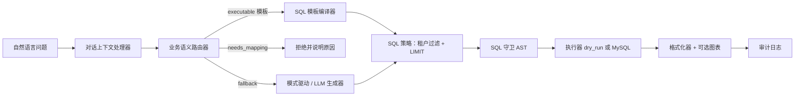

# 架构

`text2sql-mvp` 验证了一套适合生产环境分析助手的**受保护 Text-to-SQL 流水线**。LLM 永远不会获得一个通用的 SQL 执行器；每条路径都受到白名单模式和业务语义的约束。

## 请求流程

## 分层架构

### 1. 白名单模式（`configs/whitelist_tables.yaml`）

定义允许的表、列、预估行数、索引和连接路径。SQL 守卫会拒绝任何引用此目录之外对象的 SQL。

每个受限表声明一个 `domain_column`（示例：`tenant_id`）。运行时会自动注入缺失的 `table.domain_column = %(domain_id)s` 条件。

### 2. 业务语义（`configs/business_semantics.yaml`）

每个**意图**包含：

- 词汇匹配 `match` 规则和可选的向量 `semantic.queries`
- `status`：`executable`、`needs_mapping` 等
- 指向 `sql_templates` 的 `template` id

只有具有模板的 `executable` 意图才会在语义路径上生成 SQL，这可以有效防止幻觉指标。

### 3. 对话层

短追问会从历史记录中继承主题和分组维度。图表类型的追问（例如饼图 → 折线图）会重写之前完整的提问，而非生成模糊的查询。

### 4. SQL 策略与守卫

- 仅允许 SELECT
- 敏感值参数化（电话号码不会嵌入 SQL 文本中）
- 非标量结果自动添加 LIMIT
- 在线模式下可选的基于 EXPLAIN 的成本拒绝

### 5. 执行模式

| 模式 | 行为 |
|------|------|
| `dry_run`（默认） | 编译并验证 SQL，返回执行计划 |
| `live` | 凭据配置后，在 MySQL 上实际执行 |

### 6. 对外接口

- **HTTP**（`text2sql_api`）—— `/v1/query`、`/v1/query/estimate`、审计 API、`/chat`
- **MCP**（`text2sql_mcp`）—— 以工具/资源形式提供相同的 `Text2SqlService`

## 为你的产品定制

1. 替换 `whitelist_tables.yaml` 为你自己的模式（使用 `scripts/introspect_schema.py`）。
2. 在 `business_semantics.yaml` 中添加意图和 SQL 模板。
3. 扩展 `eval_cases/cases.yaml` 以覆盖回归测试。
4. 可选择通过 `.env.local` 启用 LLM 回退 —— 语义模板始终是主要路径。

## 演示领域

内建配置模拟了一个支付分析场景：

- `payment_order` —— 渠道、金额、状态、付款人手机号（敏感字段）
- `refund_order` —— 每日退款数量
- `merchant` —— 按支付量排名

这些数据模型刻意保持精简，方便 fork 后快速上手。
