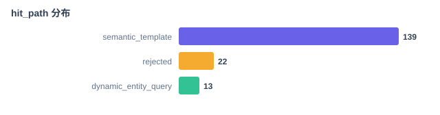
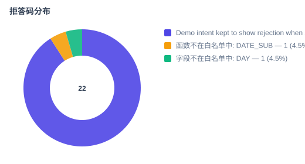
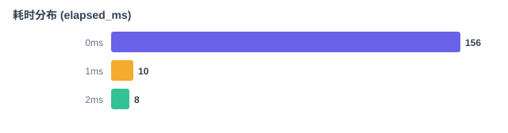
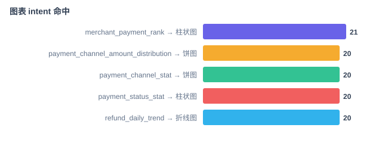

# 审计数据分析报告

> 由 `scripts/analyze_audit.py` 自动生成，可重复运行；输入不变则输出不变。

- 审计库: `data/audit.sqlite3`
- 评测用例: `eval_cases/cases.yaml` (11 条)
- 记录总数: 174

## 1. 路由分支分布

| hit_path | 记录数 | 占比 |
| --- | ---: | ---: |
| `semantic_template` | 139 | 79.9% |
| `rejected` | 22 | 12.6% |
| `dynamic_entity_query` | 13 | 7.5% |

## 2. 拒答码分布

共 22 条被拒答，占总量 12.6%。

| 拒答码 | 次数 | 占拒答比 |
| --- | ---: | ---: |
| Demo intent kept to show rejection when semantics are not mapped. | 20 | 90.9% |
| 函数不在白名单中: DATE_SUB | 1 | 4.5% |
| 字段不在白名单中: DAY | 1 | 4.5% |

## 3. 耗时分布 (elapsed_ms)

- min: 0 ms
- p50: 0 ms
- p90: 1 ms
- max: 2 ms

| 区间 | 记录数 |
| --- | ---: |
| 0ms | 156 |
| 1ms | 10 |
| 2ms | 8 |

## 4. 图表命中

- 图表候选 intent（visualization.CHART_INTENTS）共 5 个: merchant_payment_rank, payment_channel_amount_distribution, payment_channel_stat, payment_status_stat, refund_daily_trend
- planned 记录 152 条，其中命中图表的 99 条，命中率 65.1%

| intent | 默认图表 | 次数 |
| --- | --- | ---: |
| `merchant_payment_rank` | 柱状图 (`bar`) | 21 |
| `payment_channel_amount_distribution` | 饼图 (`pie`) | 20 |
| `payment_channel_stat` | 饼图 (`pie`) | 20 |
| `payment_status_stat` | 柱状图 (`bar`) | 20 |
| `refund_daily_trend` | 折线图 (`line`) | 20 |

## 5. 评测用例覆盖矩阵

| case_id | question | 路由 | intent | template | 拒答码 | 审计中已复现 |
| --- | --- | --- | --- | --- | --- | :---: |
| `payment-order-count` | 支付订单总数是多少 | `semantic_template` | `payment_order_count` | `payment_order_count` | - | ✓ |
| `payment-channel-stat` | 支付订单按渠道统计 | `semantic_template` | `payment_channel_stat` | `payment_channel_stat` | - | ✓ |
| `payment-status-stat` | 支付订单按状态统计 | `semantic_template` | `payment_status_stat` | `payment_status_stat` | - | ✓ |
| `merchant-count` | 商户总数是多少 | `semantic_template` | `merchant_count` | `merchant_count` | - | ✓ |
| `refund-trend` | 近7天每日退款笔数趋势 | `semantic_template` | `refund_daily_trend` | `refund_daily_trend` | - | ✓ |
| `channel-amount-chart` | 各支付渠道交易金额分布 | `semantic_template` | `payment_channel_amount_distribution` | `payment_channel_amount_distribution` | - | ✓ |
| `merchant-rank` | 商户交易金额排名 | `semantic_template` | `merchant_payment_rank` | `merchant_payment_rank` | - | ✓ |
| `payment-amount-average` | 支付订单平均金额 | `dynamic_entity_query` | `payment_amount_average` | `dynamic_entity_query` | - | ✓ |
| `reject-unconfigured` | 请统计火星基地飞船泊位能耗 | `rejected` | `unconfigured_demo` | `-` | Demo intent kept to show rejection when semantics are not mapped. | ✓ |
| `reject-phone-missing-slot` | 按手机号查询支付订单 | `rejected` | `-` | `-` | 缺少必要条件 | ✗ |
| `reject-sensitive-field` | 查询支付订单付款手机号 | `rejected` | `-` | `-` | 敏感字段 | ✗ |

### 未覆盖的分支

| 维度 | 值 |
| --- | --- |
| rejection_reason | `函数不在白名单中: DATE_SUB` |
| rejection_reason | `字段不在白名单中: DAY` |

> 说明：审计中出现的历史拒答码可能因白名单/护栏配置调整而无法在当前运行时复现，只能作为回溯凭证保留。`configured_intent` 表示 `business_semantics.yaml` 里配置为 executable 但评测用例未覆盖的 intent。

## 6. 结论

1. 路由集中度极高：`semantic_template` 命中 139/174 = 79.9%，说明主路径仍是语义模板匹配，动态实体查询与拒答只占尾部；容量规划应按语义模板的 QPS 上限来算，不是按拒答分支。
2. 拒答口径不健康：20/22 = 90.9% 的拒答都是 “Demo intent kept to show rejection when semantics are not mapped.”，这是留在配置里做兜底演示的空 intent；真实的白名单拦截（函数/字段不在白名单）只有 2 条。评估失败率时应把这一类兜底剔除，否则会把拒答率算虚高。
3. 耗时分布 p50=0ms / p90=1ms / max=2ms 全部在毫秒级，是因为审计里的样本几乎全走 `dry_run`（execution.mode='dry_run'），没有真正下推 MySQL。要观测端到端延时应挂上一份 live 审计再重跑，不要用当前数字对外承诺 SLA。

